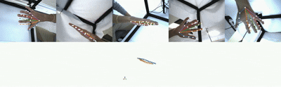

# Proyecto MYOREHAB

## 🧠 Descripción

**MYOREHAB** es un sistema de análisis de movimiento orientado a la rehabilitación muscular. Utiliza tecnologías de visión computacional como **Anipose** (para triangulación 3D a partir de cámaras múltiples) y **MediaPipe** (para la detección de poses en tiempo real).

---

## 📁 Estructura del Proyecto

```bash
MYOREHAB/
├──environments/
├──recording/
│   ├── calibration/                # Archivos de calibración de cámaras   
│   ├── videos-raw/                 # Videos sin procesar (entrada)
│   ├── mediapipe_analyze.py        # Script principal de análisis con MediaPipe
├── config.toml                     # Archivo de configuración general
├── README.md
```

---

## 💻 Instalación de Entornos

Asegúrate de haber instalado ANACODA (Gestor de Entornos Virtuales)
- [Web Oficial de Anaconda](https://www.anaconda.com/docs/main)

### 1. Entorno de Anipose

```bash
conda env create -f env_anipose.yml
```

* Instalar MediaPipe en otro entorno para ejecutar el _mediapipe_analyze.py_
* Crear la estructura del proyecto.

### 2. Detección de puntos con MediaPipe

```bash
python mediapipe_analyze.py
```

### 3. Calibración y triangulación con Anipose

```bash
anipose filter
anipose calibrate
anipose triangulate
anipose label-2d
anipose label-2d-filter
anipose label-3d
anipose label-combined
```

---

## 📽 Resultados

Aquí se muestra un ejemplo visual del análisis de movimiento realizado:

<p align="center">
  
</p>

---

## 📚 Fuentes y referencias

Durante el desarrollo del proyecto se consultaron las siguientes fuentes:

- [Tutorial de Anipose por Pigeon Supermodel](https://pigeonsupermodel.com/UsingAnipose3D.html#create-directory-structure)  
- [Repositorio oficial de DeepLabCut](https://github.com/DeepLabCut/DeepLabCut/tree/main)  
- [Documentación oficial de Anipose](https://anipose.readthedocs.io/en/latest/tutorial.html)
